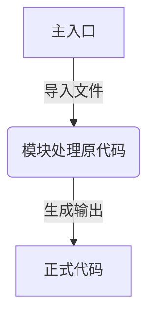
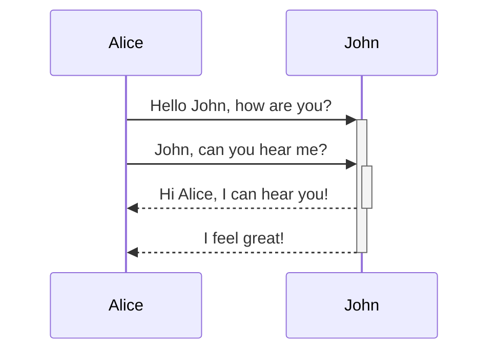

## webpack

[官方中文站点][webpack.docschina.org]

shell 执行 `npx webpack` 或者 脚本执行 `webpack`

## 基本流程

## 模块插件说明
1. `HtmlWebpackPlugin` 动态处理`html`文件；

    > **下面这条很坑啊！！！！**

2. `MiniCssExtractPlugin` 单独使用:只负责剥离css代码为独立文件；配合`HtmlWebpackPlugin`插件:能够把生成的`css`文件,静态插入`<head></head>`标签内。

# 顺序图

[webpack.docschina.org]: https://webpack.docschina.org