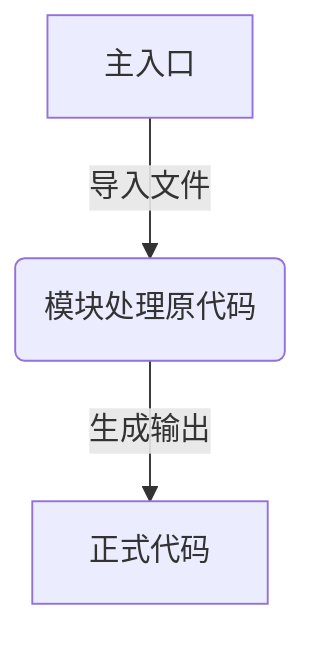
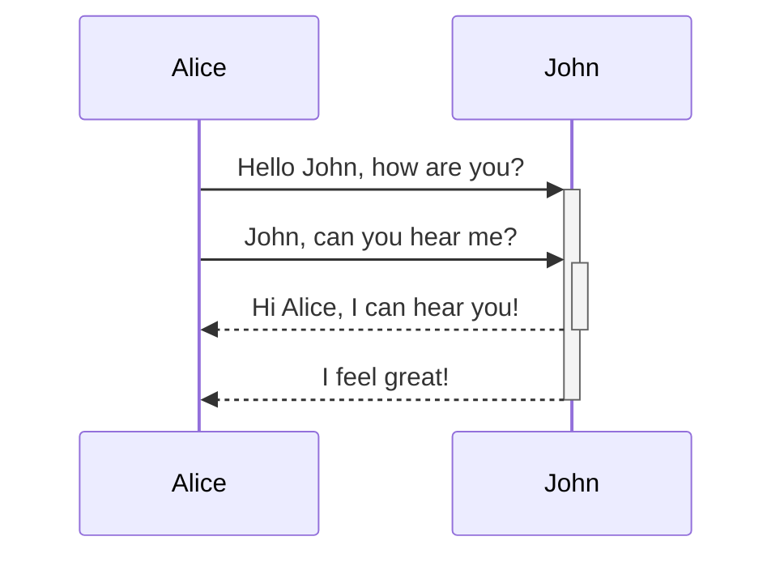

## webpack

[官方中文站点][webpack.docschina.org]

shell 执行 `npx webpack` 或者 脚本执行 `webpack`

## 基本流程

## 模块插件说明
1. `CleanWebpackPlugin` 用于清除老文件; 官方地址:[https://github.com/johnagan/clean-webpack-plugin](https://github.com/johnagan/clean-webpack-plugin)

1. `HtmlWebpackPlugin` 动态处理`html`文件；官方地址:[https://github.com/jantimon/html-webpack-plugin](https://github.com/jantimon/html-webpack-plugin)

    > **下面这条很坑啊！！！！**

2. `MiniCssExtractPlugin` 单独使用:只负责剥离css代码为独立文件；配合`HtmlWebpackPlugin`插件:能够把生成的`css`文件,静态插入`<head></head>`标签内。

## 开发工具

1. `Webpack-dev-server` 提供实时重新加载服务: 官方地址:[https://github.com/webpack/webpack-dev-server](https://github.com/webpack/webpack-dev-server)

# 顺序图

[webpack.docschina.org]: https://webpack.docschina.org

[https://github.com/jantimon/html-webpack-plugin]: https://github.com/jantimon/html-webpack-plugin