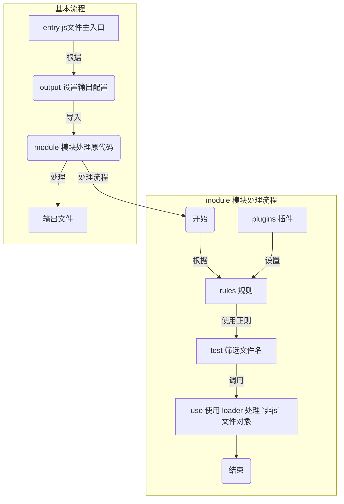
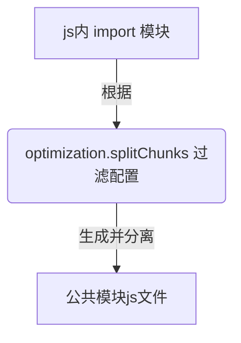

## webpack

[官方中文站点][webpack.docschina.org]

shell 执行 `npx webpack` 或者 脚本执行 `webpack`

## 基本流程

## 模块插件说明
1. `CleanWebpackPlugin` 用于清除老文件; 官方地址:[https://github.com/johnagan/clean-webpack-plugin](https://github.com/johnagan/clean-webpack-plugin)

1. `HtmlWebpackPlugin` 动态处理`html`文件；官方地址:[https://github.com/jantimon/html-webpack-plugin](https://github.com/jantimon/html-webpack-plugin)

    > **下面这条很坑啊！！！！**

2. `MiniCssExtractPlugin` 单独使用:只负责剥离css代码为独立文件；配合`HtmlWebpackPlugin`插件:能够把生成的`css`文件,静态插入`<head></head>`标签内。

## 开发工具

1. `Webpack-dev-server` 提供实时重新加载服务: 官方地址:[https://github.com/webpack/webpack-dev-server](https://github.com/webpack/webpack-dev-server)

## 代码分离
使用`SplitChunksPlugin`模式，根据配置自动去重复模块，还能批量分组，设置分离出的单个文件大小.

## 缓存设置

简要概括：

- `main bundle` 会随着自身的新增内容的修改，而发生变化。
- `vendor bundle` 会随着自身的 module.id 的变化，而发生变化。
- `manifest runtime` 会因为现在包含一个新模块的引用，而发生变化。

第一个和最后一个都是符合预期的行为，vendor hash 发生变化是我们要修复的.

> 固定在内容不变情况下，保持moduleId不变，进而保证哈内容希值不变,用与缓存保证

修改设置:`optimization.moduleIds = deterministic`

[webpack.docschina.org]: https://webpack.docschina.org

[https://github.com/jantimon/html-webpack-plugin]: https://github.com/jantimon/html-webpack-plugin